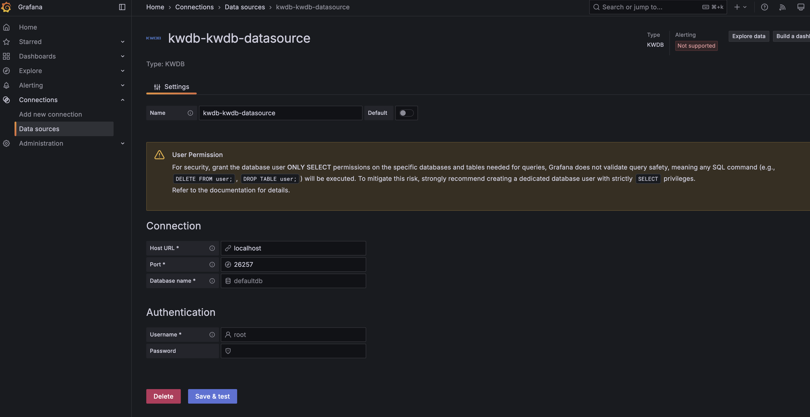
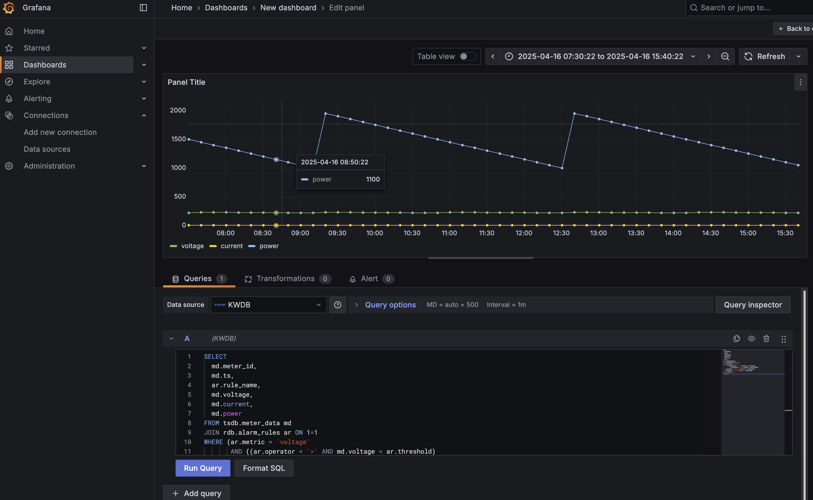

# KWDB Grafana Plugin

**KWDB is a distributed multi-model database designed for AIoT scenarios and incubated by the OpenAtom Foundation.​**​ Originating from Inspur's KaiwuDB project, it supports the concurrent creation of time-series and relational databases within the same instance and the integrated processing of multi-model data.

KWDB data source plugin for Grafana enables you to query and visualize metrics from the KWDB database. It supports both time-series and relational data with a rich set of features for database connectivity and query management.




## Features

### 📝 **Advanced SQL Query Editor**
- Syntax-highlighted SQL code editor with line numbers
- Built-in SQL query formatting using Prettier
- Real-time query execution with loading states
- Support for multi-line complex SQL queries

### 🕒 **Time-Series Support**
- Built-in Grafana time range macros:
  - `$from` - Start time of the selected time range
  - `$to` - End time of the selected time range  
  - `$interval` - Time interval based on the selected time range
- Template variable support for dynamic queries

### 🎯 **User Experience**
- Interactive query help and cheat sheet
- Comprehensive error handling and user feedback
- Responsive UI components with proper validation


## Installation

### From Grafana Plugin Catalog
1. In your Grafana instance, go to **Administration** > **Plugins**
2. Search for "KWDB" in the plugin catalog
3. Click **Install** to add the plugin to your Grafana instance

### Manual Installation
1. Download the latest release from the [GitHub releases page](https://github.com/KWDB/grafana-plugin/releases)
2. Extract the plugin to your Grafana plugins directory
3. Restart your Grafana instance

## Configuration

### Adding the Data Source

1. In Grafana, navigate to **Connections** > **Add new connection**
2. Search for and select **KWDB** from the list of available data sources
3. Click **Add new data source**
4. Configure the connection settings:

#### Connection Settings
- **Host URL**: Your KWDB server address (e.g., `localhost`)
- **Port**: KWDB server port (default: `26257`)
- **Database name**: Target database name (default: `defaultdb`)

#### Authentication
- **Username**: Database user account (default: `root`)
- **Password**: Database user password (stored securely)

⚠️ **Security Recommendation**: For production use, create a dedicated database user with **SELECT-only** permissions on the specific databases and tables needed for your dashboards.

5. Click **Save & Test** to verify the connection

## Usage

### Writing Queries

1. Create a new dashboard or edit an existing one
2. Add a new panel and select your KWDB data source
3. Write your SQL query in the query editor:

```sql
SELECT 
  time_column,
  value_column
FROM your_table 
WHERE time_column >= $from 
  AND time_column <= $to
ORDER BY time_column
```

### Using Time Range Macros

KWDB data source supports Grafana's time range macros:

- `$from` - Replaced with the start time of the dashboard's time range
- `$to` - Replaced with the end time of the dashboard's time range
- `$interval` - Replaced with a time interval suitable for the current time range

### Query Formatting

Use the **Format SQL** button in the query editor to automatically format your SQL queries for better readability.

## Troubleshooting

### Common Issues

#### Connection Failed
- Verify that your KWDB server is running and accessible
- Check that the host and port are correct
- Ensure the database name exists
- Verify username and password credentials
- Check firewall settings and network connectivity

#### Query Errors
- Ensure your SQL syntax is compatible with KWDB
- Verify that referenced tables and columns exist
- Check that the database user has SELECT permissions on the queried tables
- Use the query formatter to identify syntax issues

#### No Data Returned
- Verify that your time range macros (`$from`, `$to`) are used correctly
- Check that your time column data type is compatible
- Ensure your WHERE clause filters are appropriate for the selected time range

### Getting Help

- 📖 [KWDB Documentation](https://www.kaiwudb.com/kaiwudb_docs/#/oss_dev/)
- 🐛 [Report Issues](https://github.com/kwdb/kwdb/issues/new)
- 💬 [GitHub Discussions](https://github.com/kwdb/kwdb)

## Development

This section is for developers who want to contribute to or modify the KWDB Grafana plugin.

### Prerequisites

- Node.js 18+ and npm
- Go 1.21+
- Grafana 10.4.0+

## Getting started

### Backend

1. Update [Grafana plugin SDK for Go](https://grafana.com/developers/plugin-tools/key-concepts/backend-plugins/grafana-plugin-sdk-for-go) dependency to the latest minor version:

   ```bash
   go get -u github.com/grafana/grafana-plugin-sdk-go
   go mod tidy
   ```

2. Build backend plugin binaries for Linux, Windows and Darwin:

   ```bash
   mage -v
   ```

3. List all available Mage targets for additional commands:

   ```bash
   mage -l
   ```

### Frontend

1. Install dependencies

   ```bash
   npm install
   ```

2. Build plugin in development mode and run in watch mode

   ```bash
   npm run dev
   ```

3. Build plugin in production mode

   ```bash
   npm run build
   ```

4. Run the tests (using Jest)

   ```bash
   # Runs the tests and watches for changes, requires git init first
   npm run test

   # Exits after running all the tests
   npm run test:ci
   ```

5. Spin up a Grafana instance and run the plugin inside it (using Docker)

   ```bash
   npm run server
   ```

6. Run the E2E tests (using Playwright)

   ```bash
   # Spins up a Grafana instance first that we tests against
   npm run server

   # If you wish to start a certain Grafana version. If not specified will use latest by default
   GRAFANA_VERSION=11.3.0 npm run server

   # Starts the tests
   npm run e2e
   ```

7. Run the linter

   ```bash
   npm run lint

   # or

   npm run lint:fix
   ```

## Contributing

We welcome contributions to the KWDB Grafana plugin! Here's how you can help:

### Reporting Issues
- Use the [GitHub issue tracker](https://github.com/kwdb/kwdb/issues/new) to report bugs
- Provide detailed information about your environment and steps to reproduce
- Include relevant logs and error messages

### Contributing Code
1. Fork the repository
2. Create a feature branch (`git checkout -b feature/amazing-feature`)
3. Make your changes and add tests
4. Ensure all tests pass (`npm run test` and `npm run e2e`)
5. Commit your changes (`git commit -m 'Add amazing feature'`)
6. Push to the branch (`git push origin feature/amazing-feature`)
7. Open a Pull Request

## License

This project is licensed under the Apache License 2.0 - see the [LICENSE](LICENSE) file for details.
